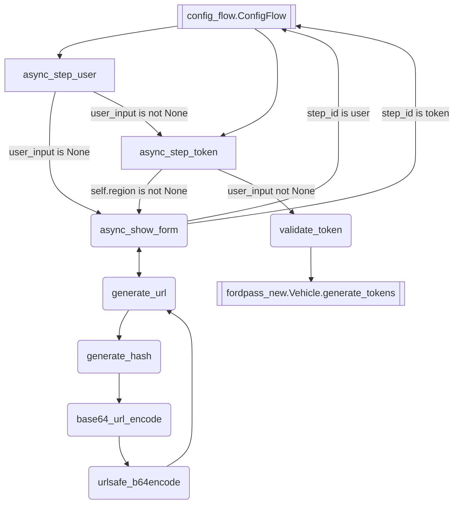

# documenting how to implement using the fordpass-ha library outside of homeassistant
## initial configuration uses fordpass.ConfigFlow
```shell
Jun 13 21:45:57 hostname homeassistant/8280ec07e0a1[146]: #033[36m2024-06-13 21:45:57.703 DEBUG (MainThread) [custom_components.fordpass.config_flow:146}] USA#033[0m
Jun 13 21:45:57 hostname homeassistant/8280ec07e0a1[146]: #033[36m2024-06-13 21:45:57.703 DEBUG (MainThread) [custom_components.fordpass.config_flow:190}] Region#033[0m
Jun 13 21:45:57 hostname homeassistant/8280ec07e0a1[146]: #033[36m2024-06-13 21:45:57.703 DEBUG (MainThread) [custom_components.fordpass.config_flow:191}] USA#033[0m
Jun 13 21:45:57 hostname homeassistant/8280ec07e0a1[146]: #033[36m2024-06-13 21:45:57.703 DEBUG (MainThread) [custom_components.fordpass.config_flow:211}] {'region': '71A3AD0A-CF46-4CCF-B473-FC7FE5BC4592', 'locale': 'en-US', 'locale_short': 'USA', 'locale_url': 'https://login.ford.com'}#033[0m
```
### within fordpass.ConfigFlow, function async_step_user
1. requires user_input of username and region
1. jumps to async_step_token, supplying it with None
### within fordpass.ConfigFlow, function async_step_token
1. if user_input is None
1. skips to checking if self.region is not None, we set that with async_step_user with user_input
1. returns with async_show_form
1. supplies auth URL
1. waits for user_input of tokenstr
#### within fordpass.ConfigFlow, function generate_url
1. interesting, I do not think it uses the username at all in the generation of the auth url
1. random 43 lower case characters are chosen for code1
1. a sha256 hash of code1 is generated
1. stored in self.login_input as key code_verifier
1. URL is composed of:
```shell
url = f"{REGIONS[region]['locale_url']}/" # const.py REGIONS["USA"]["https://login.ford.com"]
url = url + "4566605f-43a7-400a-946e-89cc9fdb0bd7/" # SSO resource?
url = url + f"B2C_1A_SignInSignUp_{REGIONS[region]['locale']}/" # const.py REGIONS["USA"]["en-US"]
url = url + "oauth2/"
url = url + "v2.0/"
url = url + "authorize?"
url = url + "redirect_uri=fordapp://userauthorized&"
url = url + "response_type=code&"
url = url + "max_age=3600&"
url = url + f"code_challenge={code_verifier}&" # the code_challenge is the sha256 hash of the random 43 lowercase characters
url = url + "code_challenge_method=S256&"
url = url + "scope=%2009852200-05fd-41f6-8c21-d36d3497dc64%20openid&" # scope = :space: client_id :space: openid
url = url + "client_id=09852200-05fd-41f6-8c21-d36d3497dc64&"
url = url + f"ui_locales={REGIONS[region]['locale']}&" # const.py REGIONS["USA"]["en-US"]
url = url + f"language_code={REGIONS[region]['locale']}&" # const.py REGIONS["USA"]["en-US"]
url = url + f"country_code={REGIONS[region]['locale_short']}&" # const.py REGIONS["USA"]["USA"]
url = url + f"ford_application_id={REGIONS[region]['region']}" # const.py REGIONS["USA"]["71A3AD0A-CF46-4CCF-B473-FC7FE5BC4592"]
```
#### the user loads the URL, logs in, copies response per wiki
1. URL and response are returned to async_step_token as async_show_form
1. returned to async_step_user
# mermaid diagram

